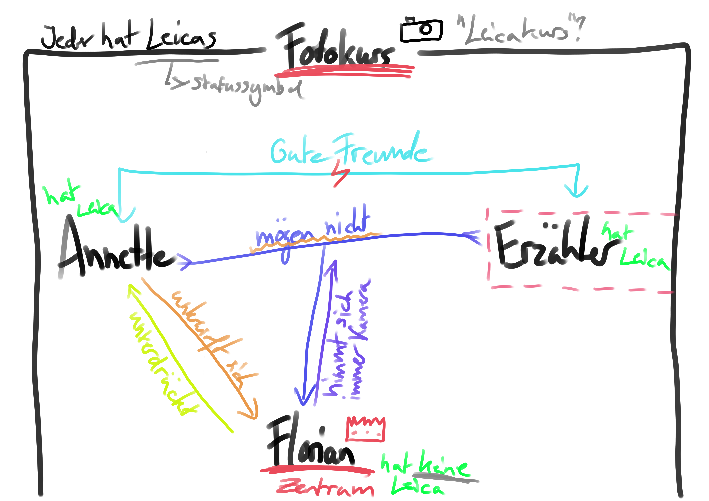

# Leicas

## Thesen

- Die Geschichte dreht sich mit der Zeit immer mehr um ihn
    - Florian ist das Zentrum der Geschichte und der Erzähler ist ein Beobachter
        - Man weiß nicht viel über den Erzähler
    - Die Liebe zwischen Protagonist und Annette ist am Anfang leicht vorhanden, zerbricht aber mit Florians Monolog
        - Annette ist quasi von Florian besessen
    - Er nimmt mehr Kontrolle über den Text, gleich wie er mehr Kontrolle über die Protagonisten nimmt
    - Die ganze Stimmung ändert sich mit mit Florians Monolog
- Florian ist mächtig
    - Angst und Unterwerfung
    - Stellt den Lehrer bloß
    - Allein Florians Präsenz verändert die Atmosphäre
    - Es bildet sich ein leichter Kult um Florian herum, alle unterwerfen sich ihm (Ehrfurcht)
    - Jeder möchte ihm die eigene Kamera leihen
    - Er zerstört Annettes Kamera am Ende der Geschichte

$\rightarrow$ Florian wächst zu einer Machtperson heran?

Extra These!

- Florian ist mit der Macht unzufrieden
    - Alle wollen ihm die Kamera in den Arsch schieben
    - Die Kamera wird ihm von den anderen aufgedrängt
    - Annette hat quasi mehrmals probiert ihm die Kamera zu schenken (Z. 72)
        - "verbunden mit üblen Flüchen, in den Bauch pressend" (Z. 74)
    - Ihm geht das so sehr auf den Sack
    - Erklärt warum er am Ende die Kamera zerstört

## Themenblatt

> Erarbeitet ein gemeinsames Thesenblatt. Integriert hierzu ein Schaubild, welches sowohl die Themen/das Thema, als auch das Verhältnis der Charaktere zueinander darstellt.

## Thematik

- Fotos halten Momente fest, aber nur oberflächlich
    - Oberflächliche Beziehung zwischen Annette und Erzähler
    - Oberflächliche Beziehung zwischen allen und Florian
- Kult, Opfergabe
- Alle außer Florian haben eine Leica
    - Warum ist FLorian Teil der Gruppe obwohl er keine hat?
    - Warum wird er das Zentrum?
