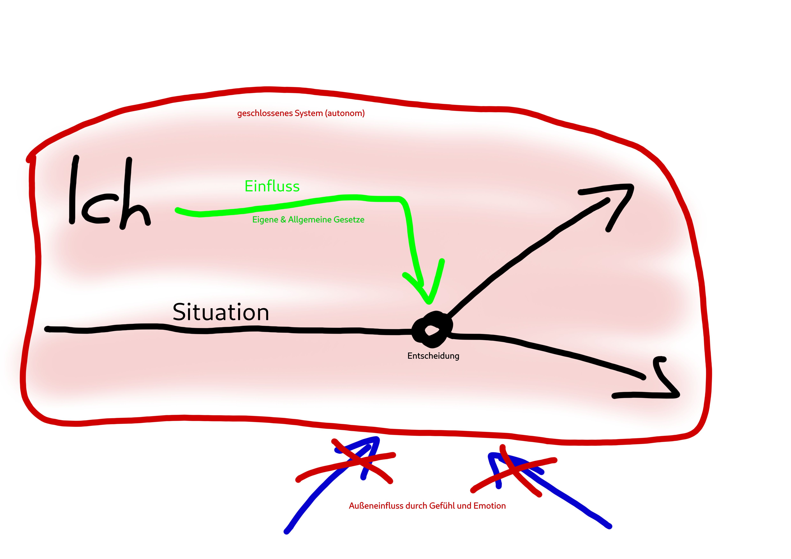

# 2020-04-21

## Aufgabe 1

- [Quelle 1](https://www.dropbox.com/s/gbq2584tone4m0z/Moralische%20Autonomie%20als%20Würde%20des%20Menschen.pdf?dl=0)
- [Quelle 2](https://www.dropbox.com/s/6dcyfkevntxov0p/Die%20Würde%20des%20Menschen%20-%20Hilfetext.pdf?dl=0)

## Aufgabe 2

[Quelle](https://www.dropbox.com/s/0jna39w9werumkf/Die%20zehn%20Gebote%20Bergpredigt%20Eichmann%20BGB%20Kat.Imp.%20Vergleich.pdf?dl=0)

> Hier finden Sie neben dem kategorischen Imperativ Kants
>
> - eine Aufstellung der 10 Gebote
> - einen Auszug aus der Bergpredigt
> - den sogenannten "kategorischen Imperativ des Dritten Reiches"
> - einen Paragraphen aus dem BGB
>
> Überlegen Sie, welche dieser Vorstellungen mit dem Prinzip der Autonomie vereinbar sind.

Die zehn Gebote sind von Natur aus an den Glauben an Gott gebunden, die Gebote basieren auf dem Willen von Gott, welche man als Gläubiger nicht brechen "darf". Man nehme Bezug auf das erste Gebot. Daher entsprechen diese nicht dem autonomischem Prinzip.

Der kategorische Imperativ hingegen basiert auf einem Gesetz, welches man selber aufstellt und welche nicht auf der Maxime einer anderen Person basiert. Autonom.

Die Bergpredigt zwingt keine Handlungen auf, sondern ist nur eine (ich nenne es jetzt einfach mal) Empfehlung von Handlungen. Man achte auf die Wortwahl, "Seeling sind die, ..." verglichen zu "Du sollst ..." in den zehn Geboten. Da eine Empfehlung (oder wie es in der ersten Quelle genannt wurde) eine Notwendigkeit ist und keine "Pflicht", widerspricht die Bergpredigt nicht dem autonomischen Prinzip.

Der kategorische Imperativ des Dritten Reiches zwingt die Maxime einer anderen Person auf einen auf. Nicht autonom.

Das BGB zwingt einem keinen Willen auf, auch hier ist nur eine "Empfehlung" einer Handlung gegeben. Mord wird zwar bestraft, aber jeder hat die Wahl zu morden oder nicht zu morden. Vgl. das fünfte Gebot, welches einem vorschreibt, dass man nicht morden darf. Autonom

## Aufgabe 3

> Wenn wir schon bei religiösen Moralvorstellungen sind:
>
> - Ist die Ethik des Islam mit dem Prinzip der Autonomie vereinbar?
> - Unter welchen Bedingungen kann das Befolgen göttlicher Gebote, egal in welcher Religion, dem Autonomieprinzip entsprechen?
>
> Stellen Sie dies ebenfalls grafisch dar?

*Inwiefern ist diese Aufgabe grafisch darzustellen?*

Die Ethik des Islams ist genauso an den Glauben an Gott gebunden wie der Christentum. Es lässt sich die gleiche Begründung für die zehn Gebote nutzen. Nicht autonom.

Solange die göttlichen Gebote einem keinen WIllen aufzwingen sollte es dem Autonomieprinzip entpsrechen.
