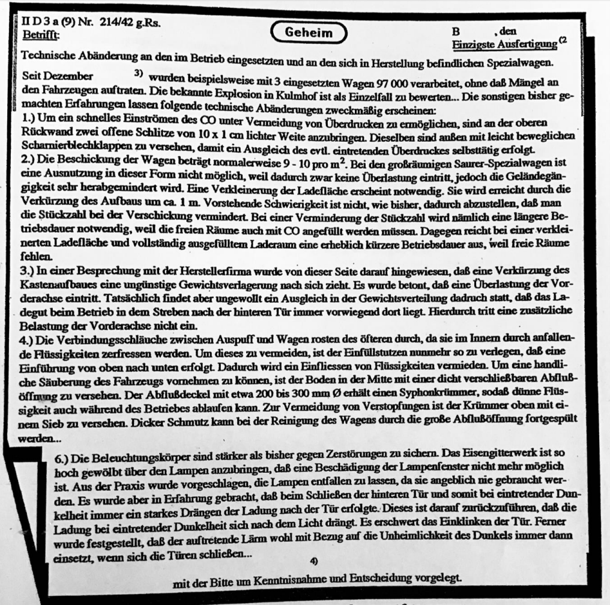

<!--
    First attempt of using Pandoc Markdown!
    Notable changes in this document:
        - There's some extra metadata at the top, used for tex/pdf conversion with Pandoc
        - Using the {width=50%} tag for an image tag

    Notable changes to the notation environment:
        - The kzvi.pandoc-markdown-preview extension is used to generate a preview
        - The dougfinke.vscode-pandoc extension makes it pretty easy to easily convert to pdf/docx/html
        - Otherwise, the command line can be used
        - Obviously, pandoc is required
-->

# Thema 1: Die Judenvernichtung im Nationalsozialismus

{width=50%}

## Aufgabe 1

> Füllen Sie die Lücken 2 Datum, 3 Jahreszahl, 4 möglicher Verfasser in Q1 aus.

| Lücke               | Inhalt                     |
| ------------------- | -------------------------- |
| Datum               | 20. Jan 1942               |
| Jahreszahl          | 1941                       |
| Möglicher Verfasser | Reichssicherheitshauptsamt |

## Aufgabe 2

> Analysieren Sie, um was es in diesem Briefwechsel gehen könnte.

Es ging wahrscheinlich um neue technische Vorschriften bezüglich der Spezialwagen,
welche genutzt wurden um die Juden zu vergasen. Dabei ging der Brief wahrscheinlich
an sämtliche Herstellerfirmen. Dies wahr wahrscheinlich das Ergebnis, welches sich
aus dem Treffen am Wannsee in Berlin am 20. Januar 1942 ergeben hatte.

## Aufgabe 3

> In einem Grußwort an die AfD-Jugend sagte der Parteivorsitzende und Chef der
> Bundestagsfraktion Alexander Gauland, Hitler und die Nationalsozialisten seien
> „nur ein Vogelschiss“ in 1000 Jahren deutscher Geschichte. Beurteilen Sie die
> Vokabel "Vogelschiss" mit Blick auf die Judenverfolgung und Judenvernichtung in
> der Zeit des Nationalsozialismus.

Vogelschiss beschreibt meiner Meinung nach eine vergleichsweise kleine Menge an
*Exkrement*, wenn man diese Menge mal mit der üblichen Menge anderer Tiere
vergleicht. Damit soll wahrscheinlich gesagt werden, dass das ganze Kapitel nur
eine kleine "Verschmutzung" in der Geschichte darstellt und es nicht so groß
aufgespielt werden sollte, wie es normalerweise wird.

# Thema 2: Widerstand gegen den Nationalsozialismus

## Aufgabe 1

> Recherchieren Sie eine der folgenden Widerstandsbewegungen und sammeln
> Sie grundlegende Informationen (Personen, Ziele, Zeit, Widerstandsform):
>
> - **Edelweißpiraten**
> - Swing Jugend
> - Georg Elser
> - Die Weiße Rose
> - Dietrich Bonhoefer.

 | Information     |                                                             |
 | --------------- | ----------------------------------------------------------- |
 | Personen        | Gruppe von deutschen Jugendlichen im Alter von 14-18 Jahren |
 | Ziele           | Ablehnung der Pflicht der Hitler-Jugend                     |
 | Zeit            | ab den späten 30ern                                         |
 | Widerstandsform | Unterstützung der geflohenen Soldaten der deutschen Armee   |

## Aufgabe 2 & 3

> Schauen Sie das Zeitzeugenvideo von Jizchak Schwersenz (siehe Infobox).
>
> Beschreiben Sie Jizchak Schwersenz Situation in der Zeit des Nationalsozialismus.

Als Jude wurde man von den Nazis misshandelt. Als ihm die Abführung in ein Lager drohte,
ist er geflüchtet und untergetaucht. Er hat 2 Jahre versteckt gelebt, dabei hat er eine
Widerstandsgruppe gebildet.

## Aufgabe 4

> Analysieren Sie was in seinen Augen einen "guten Menschen" ausmacht.

*"Ein Mensch ist was lichtet, für einen anderen Menschen alles zu tun, was Ihnen nur möglich ist. [...]
Alle Helfer und Helferinnen gehören natürlich zu diesen guten, edlen, vornehmlichen Menschen."*

Ein guter Mensch unterstützt andere Menschen. Die Helfer haben zu der Zeit den Juden geholfen,
welche vom Staat aktiv verfolgt und gemordet wurden, womit man sich selbst in Gefahr stellt. Für
eine gute (helfende) Person es aber dabei egal sein, ob das Helfen der anderen Person rechtlich
gegen den Staat/das Gesetz geht, es geht rein um die Bereitschaft der Hilfestellung um ggf.
Menschenleben zu retten.
