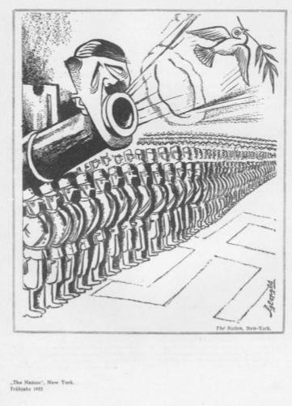
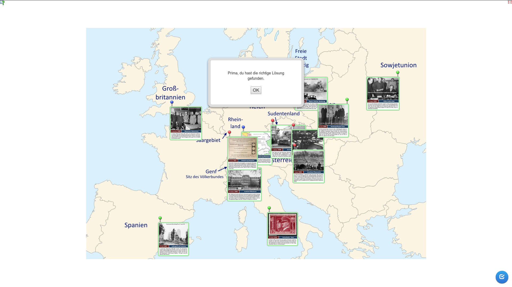

## Aufgabe 2

> Beschreiben und analysieren Sie die Karikatur Q1.

{width=50%}

Auf der Karikatur sind eine Armee als eine unendliche Reihe an
Soldaten, sowie eine Kanone abgebildet, auf welcher am Ende der Kanone
Hitler abgebildet ist, bei dem der Mund das Abschussrohr bildet. Es
wird eine Taube abgefeuert, die einen Zweig im Schnabel hält.

Mit der "Hitlerkanone" und der Taube soll die Friedenspropaganda von
Hitler symbolisiert werden, da die Taube ein bekanntes Symbol für
Frieden darstellt. Das Bild ist aber in sich selbst widersprechend,
denn mit Frieden müsste man keine Armee aufbauen und auch keine Kanone
aufbauen. Der Widerspruch gleicht dem Widerspruch von Hitlers Taten, da
er aus dem Völkerbund ausgestiegen ist um seine Armee frei aufbauen zu
können, da bestimmte Beschränkungen und Kontrollen umgangen werden.

## Aufgabe 3

> Wähle ein Ereignis aus und informiere dich genauer. Verfasse
> eigenständig einen kurzen Lexikoneintrag zu dem Ereignis.

**Austritt aus dem Völkerbund**: Nach dem ersten Weltkrieg wurde der
Völkerbund gegründet, um gegen einen weiteren Krieg in Europa
vorzubeugen. Indem Deutschland aus dem Völkerbund ausgetreten ist,
wurde es leichter heimlich eine Armee aufzubauen, da nun keine
Rüstungsbeschränkungen oder Kontrollen mehr vorlagen.

## Aufgabe 4

> Erarbeiten Sie nach der Lektüre von Q2 eine Gegenargumentation unter
> Berücksichtigung der Geschichte der nationalsozialistischen
> Außenpolitik.

Der Überfall auf Polen, welcher schlussendlich den zweiten Weltkrieg
begonnen hatte, war ein Plan, welcher über mehrere Jahre geplant und
ausgeführt wurde. Unter anderem gehört da der Nichtangriffspakt dazu,
welcher ein ausgeklügeltes taktisches Mittel darstellt. Schon seit dem
ersten Weltkrieg war es Hitlers Ziel, Deutschland eine Großmacht zu
machen, weswegen die Aussage, dass Hitler den Krieg nie gewollt hatte,
unsinnig ist.
