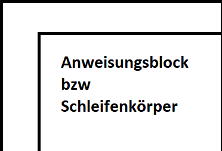

## Zählschleife



```c
for (Anweisung 1; Bedingung; Anweisung 2)
{
    // Anweisungsblock
}
```

- Anweisung 1: wird nur einmal beim Start durchgeführt.
- Ist die Bedingung erfüllt, so wird der Anweisungsblock abgearbeitet.
- Nach der Abarbeitung wird die Anweisung 2 durchgeführt und die Bedingung erneut geprüft.
