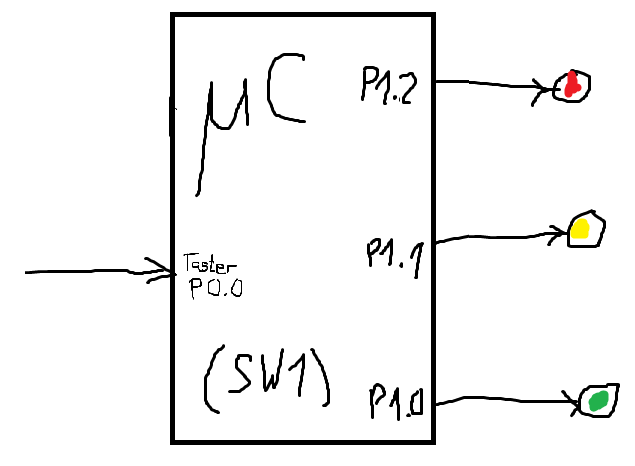

## Aufgabenstellung

Es soll eine Ampelschaltung entwickelt werden, welche alle 5 Sekunden ihren Zustand ändert.
Dabei soll die Reihenfolge wie folgt sein:

- Zustand 1: Grün
- Zustand 2: Gelb
- Zustand 3: Rot
- Zustand 4: Rot+Gelb

Die verschiedenen Farben sollen mit drei LEDs der acht LEDs von Port 1 veranschaulicht werden.
Sobald aber der Taster an P0.0 gedrückt wird, soll die Ampel automatisch in Rot (Zustand 3) wechseln
und dort für 10 Sekunden verbleiben. Danach soll es mit Zustand 4 weitergehen.

{width=25%}


## Quellcode

```cpp

// Grün, gelb, rot, rot-gelb
// Ich bin mir außerdem unsicher, ob sich Konstanten hier einfach so definieren
// lassen, deswegen lasse ich es.
int ampelZustaende[4] = [ 0b001, 0b010, 0b100, 0b110 ];

// Dadurch, dass die ampelZustandAendern() Funktion den Zustand inkrementiert,
// wird diese beim ersten Durchlauf auf 0 gesetzt. Danach ist es unmöglich,
// dass der Wert unter 0 fällt, da ich in der Funktion den Modulo 4 anwende.
int momentanerZustand = -1;

void ISR_EX0(void) interrupt 0
{
    // Die ampelZustandAendern() Funktion wartet bereits 5 Sekunden,
    // weswegen das doppelte Aufrufen der Funktion mit dem gleichen Zustand
    // in einer Dauer von 10s entspricht.

    // Nicht vergessen, Arrays sind null-indiziert
    ampelZustandAendern(2);
    ampelZustandAendern(2);
}

void initInterrupt(void)
{
    IT0 = 1;             // Negative Flanke
    EX0 = 1;             // Enable Extern 0 Interrupt
    EA = 1;              // Enable interrupts in general
    IT01CF = 0b00000000; // P0.0
}

// Der Grund, weswegen der Timer nicht als Interrupt strukturiert wurde, ist,
// da ich mir wegen der Interrupt Prioritäten unsicher war, da der EX0 Interrupt
// die ET0 Interrupt hätte unterbrechen müssen. Daher altmodisch.
int timer5s(void)
{
    int nLoops = 76;
    int buttonWasPressed = 0;
    TR0 = 1;

    while (nLoops != 0)
    {
        while (!TF0)
            continue;
        TF0 = 0;
        nLoops--;
    }
}

// -1 = nächster Zustand
void ampelZustandAendern(int zustand)
{
    if (zustand < 0)
        momentanerZustand++;
    else
        momentanerZustand = zustand;

    // Beim Zustand von 4 läuft es zu 0 über, da es nur von 0-3 geht
    momentanerZustand %= 4;

    // Es wird angenommen, dass P1 bereits zu Port 1 zugewiesen ist
    P1 = ampelZustaende[momentanerZustand];
    timer5s();
}

void main(void)
{
    initInterrupt();
    P1 = 0;
    while (1)
    {
        // -1 = nächster zustand
        ampelZustandAendern(-1);
    }
}

```
