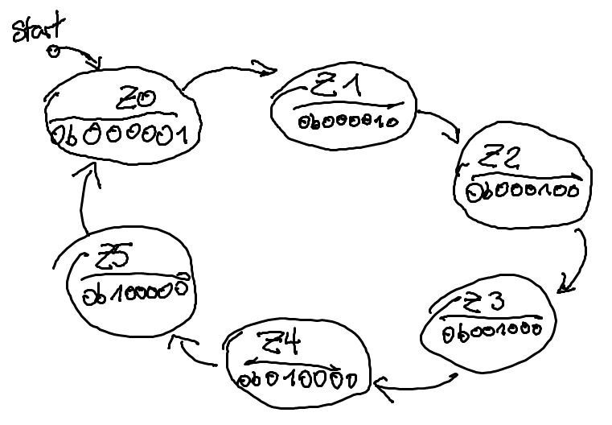
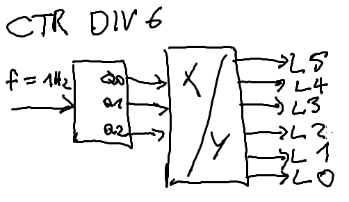

# Abiturprüfung 2016/17

## Mikrocontroller

### Aufgabe 1

#### 1.1.1 Zustandsdiagramm

#### 1.1.2 Funktionstabelle

| Q2  | Q1  | Q0  |     | L5  | L4  | L3  | L2  | L1  | L0  |
| --- | --- | --- | --- | --- | --- | --- | --- | --- | --- |
|     |     |     |     |     |     |     |     |     | 1   |
|     |     | 1   |     |     |     |     |     | 1   |     |
|     | 1   |     |     |     |     |     | 1   |     |     |
|     | 1   | 1   |     |     |     | 1   |     |     |     |
| 1   |     |     |     |     | 1   |     |     |     |     |
| 1   |     | 1   |     | 1   |     |     |     |     |     |

#### 1.1.3 Blockschaltbild

#### 1.1.4 Anzahl der Speicherelemente
