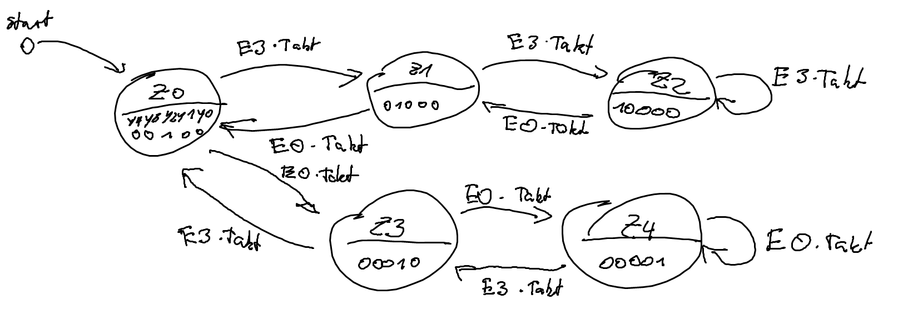
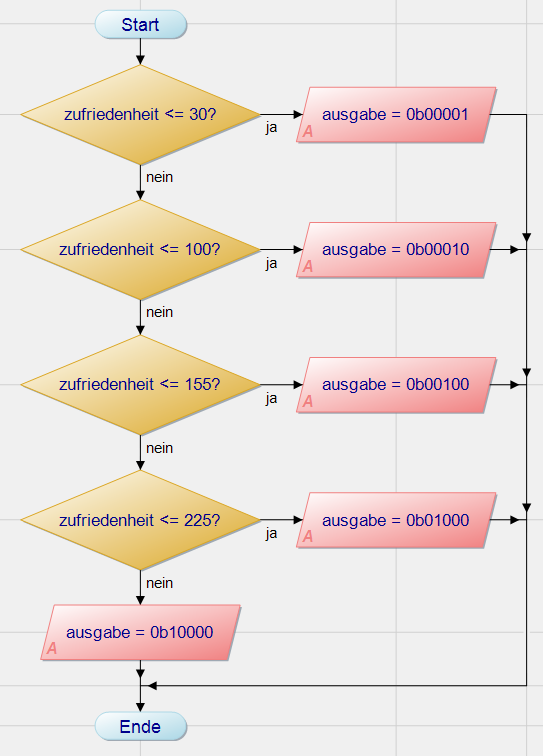

# Abiturnachprüfung 2017/18

## 2.1 Schaltwerk mit Codierer (Bonus)

### 2.1.1

$Takt = E_0 + E_3$

### 2.1.2



### 2.1.3

Es muss mindestens 3 Speicherelemente besitzen, da es insgesamt 5 mögliche Zustände gibt.

### 2.1.4

| Q2  | Q1  | Q0  |     | Y4  | Y3  | Y2  | Y1  | Y0  |
| --- | --- | --- | --- | --- | --- | --- | --- | --- |
|     |     |     |     | 1   |     |     |     |     |
|     |     | 1   |     |     | 1   |     |     |     |
|     | 1   |     |     |     |     | 1   |     |     |
|     | 1   | 1   |     |     |     |     | 1   |     |
| 1   |     |     |     |     |     |     |     | 1   |

### 2.1.5

$$
\begin{aligned}
    Y_4 &= \overline{Q_2+Q_1+Q_0} \\
    Y_3 &=  Q_0 \cdot \overline{Q_1} \\
    Y_2 &= \overline{Q_0} \cdot  Q_1 \\
    Y_1 &=  Q_0 \cdot  Q_1 \\
    Y_0 &=  Q_2 \\
\end{aligned}
$$

## 2.2 Mikrocontroller

### 2.2.1

$Y_4 \dots Y_0 \rightarrow P0_4 \dots P0_0$

$E_3 \dots E_0 \rightarrow P1_3 \dots P0_0$

### 2.2.2

```cpp
int zufriedenheit;

void init(void) {
    zufriedenheit = 128;
    P0 = 0b00100;

    TMOD = 0b00000001;
    TR0 = 0;

    ET0 = 1; // Enable timer 0 Interrupt
    EA = 1;  // Enable interrupts in general
}
```

### 2.2.3

Die Abfrage erfolgt durch einen High-Pegel durch einen der Schalter/Knöpfe. Nachdem eines betätigt wurde, wird für 1s nach dem Input alle anderen Inputs ignoriert. Danach wird geschaut ob die Taste noch betätigt wird, falls ja, wartet das Programm bis diese losgelassen wird, erst danach wird das Programm weiter ausgeführt.

Dabei soll dies die Verfälschung der Ergebnisse durch Prellung der Tasten oder durch zu oftes Drücken der Tasten vermieden werden. Wenn die Tasten prellen, wird das durch die 1s Wartezeit überbrückt, da eine Taste im Normalfall nicht länger als 1s gehalten wird. Falls sie aber doch länger gehalten wird, pausiert das Programm solange, bis die Taste losgelassen wird. Prellung und das Halten der Taste schließen sich dabei gegenseitig aus, weswegen alle Fälle gedeckt werden.

### 2.2.4

```cpp
// Vorgegebene Struktur
void sehr_zufrieden(void) {
    if (zufriedenheit == 255)
        return;
    else if (zufriedenheit == 254)
        zufriedenheit = 255;
    else
        zufriedenheit += 2;
    return;
}

// Persönliche Version
void sehr_zufrieden(void) {
    zufriedenheit += 2
    zufriedenheit = zufriedenheit > 255 ? 255 : zufriedenheit;
    return;
}
```

### 2.2.5

Ich habe gerade eine komische Situation mit Java, weswegen ich einfach ein PAP gemacht habe anstatt ein Struktogramm per Hand zu zeichnen



### 2.2.6

- Timer soll 1s warten
- Pro Maschinenzyklus gilt 1μs, daraus folgt 10^6 Zyklen für 1s
- 10^6μs lässt sich in 20 * 50000μs aufteilen
- `50000 -> 0xC350`
- `0xFFFF - 0xC350 = 0x3CAF`
- `TH0 = 0x3C, TL0 = 0xAF;`
- `anzahl = 20`
- Jeder Interrupt nimmt somit 50ms, daher muss er 20 mal ausgeführt werden, damit insgesamt 1s zusammenkommt

### 2.2.7

```cpp
int anzahl = 20;

void ISR_timer0(void) interrupt 1 {
    TH0 = 0x3C;
    TL0 = 0xAF;
    anzahl--;
}

// Extra
void warte_1s(void) {
    TR0 = 1; // Starte Timer
    while (anzahl > 0) continue; // Warte bis 20 Durchläufe abgelaufen sind
    TR = 0; // Stoppe Timer
    anzahl = 20; // Reset Counter
}
```
