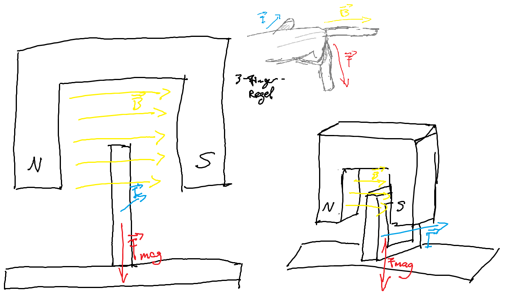

## 2.1.1

> Erstellen Sie eine Skizze, aus der folgende Größen hervorgehen:
>
> - Die Richtung des Stromflusses $\vec{I}$ durch die Flachspule
> - Die Richtung der magnetischen Flussdichte $\vec{B}$ des Permanentmagneten
> - Die Richtung der magnetischen Kraftwirkung $\vec{F}_{mag}$ auf die Spule



## 2.1.2

> Zeichnen Sie mithilfe einer Wertetabelle ein Diagramm, das die magnetische Kraft
> $F_mag$ in Abhängigkeit von der Stromstärke $I$ darstellt.


```r
stromstaerke_I <- c(0, 0.1, 0.2, 0.3, 0.4)
anzeige_m <- c(0, 0.7, 1.45, 2.1, 2.85)

# F = m*g; g = 10m/s^2
kraft_f_mag <- anzeige_m * 10/1000
plot(stromstaerke_I, kraft_f_mag, type = "b")
```

> Ermitteln Sie mithilfe des Diagramms einen möglichst genauen Wert für die
> magnetische Flussdichte $B$

Die Länge der Spule im Einfluss des Magneten lässt sich mit der Breite des Magneten
approximieren.

$$
\begin{aligned}
    B &= \frac{F_{mag}}{I_l \cdot l} \\
      &= \frac{28.5 N}{0.4A \cdot 0.03m} = 2.38T
\end{aligned}
$$

> Erläutern Sie, wie sich der Graph in dem Diagramm ändert, wenn ein Permanentmagnet
> mit der halben Flussdichte $B$ bei ansonsten unveränderter Versuchsanordnung
> eingesetzt wird. Ergänzen Sie das Diagramm mit dem neuen Graphen.

$$
\begin{aligned}
  F_{mag} &= B \cdot I_l \cdot l \qquad | :2 \\
  \frac{1}{2} F_{mag} &= \frac{1}{2} B \cdot I_l \cdot l
\end{aligned}
$$

Damit wird sich das Diagramm mit der halben Steigung zu sehen sein.


```r
kraft_f_mag <- kraft_f_mag / 2
plot(stromstaerke_I, kraft_f_mag, type = "b")
```
