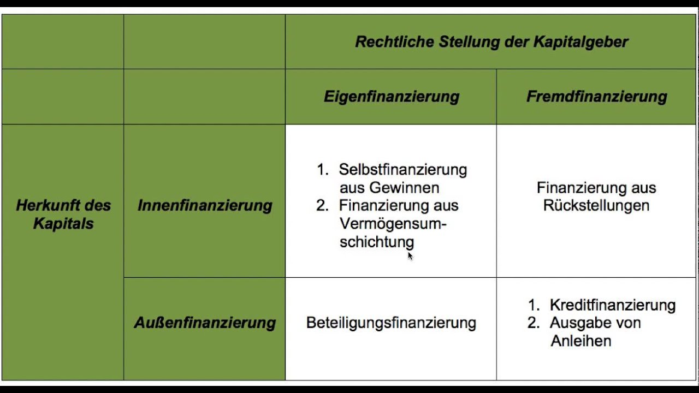

# Organisation der Unternehmensziele

- Anordnung in verschiedenen Ebenen, die die Vorebene konkretisieren
- Anordnung im Dimensionen zusammengefasst nach:
    - Inhaltliche Kriterien
    - Einfluss
    - Art des Zieles (ethisch, ökonomisch...)
    - Umsetzbarkeit/Aufwand
    - Zeitliche Dimension (kurz-, mittel-, langfristg)

## Aufgabenblatt

Die Firma Aktien AG überlegt sich, neue Druckerpressen zum Drucken von Aktien anzuschaffen. Dafür benötigt sie neues Kapital.

### Aufgabe 1

> Überlege dir, welche Möglichkeiten zur Kapitalbeschaffung die Aktien AG hat.

- Aktien verkaufen
- Crowdfunding
- Kredit
- Investoren
- Kapital investieren
- Kostenreduktion
- Rücklagen ausschlachten
- Vermögensumschichtung
- Gewinnreduktion

### Aufgabe 2

> Teile die verschiedenen Möglichkeiten in Innen- und Außenfinanzierung ein.

### Aufgabe 3

> Trage die verschiedenen Aussagen über die Struktur der Unternehmensfinanzierung zusammen.

<!--
    @author: Rave
    @date: 2020-03-05
-->

- Je weiter in der Unternehmensentwicklung, desto mehr Fremdkapital sollte aufgenommen werden
- Zwei Quellen für Kapital: Fremdkapital, Eigenkapital (inkl. ihres eigenen Geldes)
    - Verhältnis hängt von Unternehmensphase und Geschäftsmodell ab
- Nicht nach der Besten, sondern nach der passenden Unternehmensfinazierung suchen
- Bei Existenzgründung aus Eigenkapital: Finanzplan erstellen
    - "Richtigen" Kapitalbetrag beziffern
- Private Kosten werden vergessen, dies führt früh zu Geldmangel $\rightarrow$ mehr Kapital benötigt
- Relevante Faktoren für die Entscheidung das Unternehmen mit einem Investor zu teilen:
    - Grad der Freiheit in Bezug auf die Unternehmensführung
    - Unterstützung durch den neuen Gesellschaftler
    - Unternehmensbewertung
    - Höhe der Beteiligung
- Kein Gesellschaftler gewollt $\rightarrow$ Fremdkapital:
    - Spezieller Gründerkredit
    - Darlehen von der Hausbank
    - Crowdfunding
    - Onlinekredit
    - Mikrokredit
- Jeweilige Vor- und Nachteile sollen abgewogen werden (Zusätze oder Konditionen für die Tilgung)
- Bei Neugründung $\rightarrow$ schwer Kredit zu bekommen, Verbesserung der Umstände durch:
    - Bürgerschaft persönlich oder über spezielle Bürgerschaftbank übernehmen/beantragen
- Kreditwürdigkeit spielt große Rolle $\rightarrow$ Zinssatz fällt dementsprechend hoch aus
