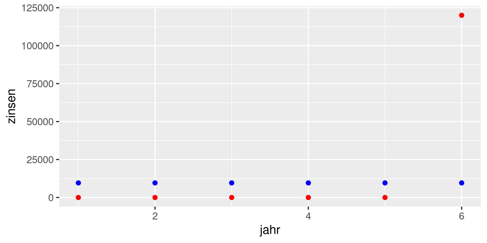
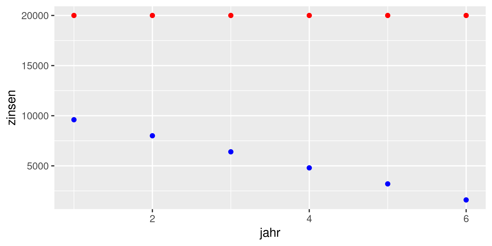
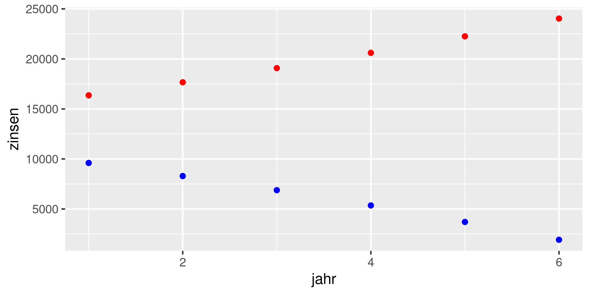

# Darlehensarten

## Fälligkeitsdarlehen

- Gesamte Darlehenssumme wird zu festgelegtem Termin zurückbezahlt
- Regelmäßige Zinszahlungen (in gleichbleibender Höhe)

| Jahr  | Darlehen Jahresanfang in € | Darlehen Jahresende in € | Tilgung in € | Zinsen in € | Mittelabfluss in € |
| :---: | :------------------------: | :----------------------: | :----------: | :---------: | :----------------: |
|   1   |          120'000           |         120'000          |      0       |    9'600    |       9'600        |
|   2   |          120'000           |         120'000          |      0       |    9'600    |       9'600        |
|   3   |          120'000           |         120'000          |      0       |    9'600    |       9'600        |
|   4   |          120'000           |         120'000          |      0       |    9'600    |       9'600        |
|   5   |          120'000           |         120'000          |      0       |    9'600    |       9'600        |
|   6   |          120'000           |            0             |   120'000    |    9'600    |      129'600       |
| Summe |                            |                          |   120'000    |   57'600    |      177'600       |



Rot: Zinsen, Blau: Tilgung

## Abzahlungsdarlehen

- Zahlung gleichbleibender Tilgungsraten
- Zahlung abnehmender Zinszahlungen (da Zinsen nur vom verbleibenden Restbetrag zu zahlen sind)

| Jahr  | Darlehen Jahresanfang in € | Darlehen Jahresende in € | Tilgung in € | Zinsen in € | Mittelabfluss in € |
| :---: | :------------------------: | :----------------------: | :----------: | :---------: | :----------------: |
|   1   |          120'000           |         100'000          |    20'000    |    9'600    |       29'600       |
|   2   |          100'000           |          80'000          |    20'000    |    8'000    |       28'000       |
|   3   |           80'000           |          60'000          |    20'000    |    6'400    |       26'400       |
|   4   |           60'000           |          40'000          |    20'000    |    4'800    |       24'800       |
|   5   |           40'000           |          20'000          |    20'000    |    3'200    |       23'200       |
|   6   |           20'000           |            0             |    20'000    |    1'600    |       21'600       |
| Summe |             -              |            -             |   120'000    |   33'600    |      153'600       |



Rot: Zinsen, Blau: Tilgung

## Annuitätsdarlehen

- Zahlung stets gleichbleibender Rückzahhlungsbeträgt ($\rightarrow$ Annuitäten)
- Annuität = Zins + Tilgung
- Durch Ratenzahlung nimmt Gesamtschuld ab, smit wird Zinsanteil geringer, im Gegenzug nimmt Tilgungsanteil zu

> Info: Die Annuität wird mithilfe von Annuitätsfaktoren berechnet; diese werden in der Praxis einer Tabelle entnommen. Der Faktor ist abhängig vom Zinssatz und der Laufzeit und beträgt in diesem Fall $0.216315$.
>
> Berechnet wird die Annuität durch die Multiplikation des Annuitätenfaktors mit der Darlehenssumme.
>
> Annuität = Annuitätenfaktor * Darlehenssumme

| Jahr  | Darlehen Jahresanfang in € | Darlehen Jahresende in € |   Tilgung in €    |  Zinsen in €  | Mittelabfluss (Annuität) in € |
| :---: | :------------------------: | :----------------------: | :---------------: | :-----------: | :---------------------------: |
|       |      *Jahresende[-1]*      |  *Jahresanfang-Tilgung*  | *Annuität-Zinsen* | *8% Darlehen* |     *Annuität\*Darlehen*      |
|   1   |          120'000           |         103'642          |      16'358       |     9'600     |            25'958             |
|   2   |          103'642           |          85'976          |      17'666       |     8'291     |            25'958             |
|   3   |           85'976           |          66'896          |      19'080       |     6'878     |            25'958             |
|   4   |           66'896           |          46'290          |      20'606       |     5'352     |            25'958             |
|   5   |           46'290           |          24'035          |      22'255       |     3'703     |            25'958             |
|   6   |           24'035           |            0             |      24'035       |     1'923     |            25'958             |
| Summe |             -              |            -             |      120'000      |    35'747     |            155'747            |



Rot: Zinsen, Blau: Tilgung

## Appendix: R Code

```r
library("ggplot2")

imageWidth = 6
imageHeight = 3

data1 <- data.frame(
    jahr = c(1:6),
    zinsen = c(9600, 9600, 9600, 9600, 9600, 9600),
    tilgung = c(0, 0, 0, 0, 0, 120000)
)

data2 <- data.frame(
    jahr = c(1:6),
    zinsen = c(9600, 8000, 6400, 4800, 3200, 1600),
    tilgung = c(20000, 20000, 20000, 20000, 20000, 20000)
)

data3 <- data.frame(
    jahr = c(1:6),
    zinsen = c(9600, 8291, 6878, 5352, 3703, 1923),
    tilgung = c(16358, 17666, 19080, 20606, 22255, 24035)
)

ggplot(data1) +
geom_point(mapping=aes(jahr, zinsen), colour = "blue") +
geom_point(mapping=aes(jahr, tilgung), colour = "red")

ggsave("2020-03-12_1.png", width=imageWidth, height=imageHeight)

ggplot(data2) +
geom_point(mapping=aes(jahr, zinsen), colour = "blue") +
geom_point(mapping=aes(jahr, tilgung), colour = "red")

ggsave("2020-03-12_2.png", width=imageWidth, height=imageHeight)

ggplot(data3) +
geom_point(mapping=aes(jahr, zinsen), colour = "blue") +
geom_point(mapping=aes(jahr, tilgung), colour = "red")

ggsave("2020-03-12_3.png", width=imageWidth, height=imageHeight)
```
